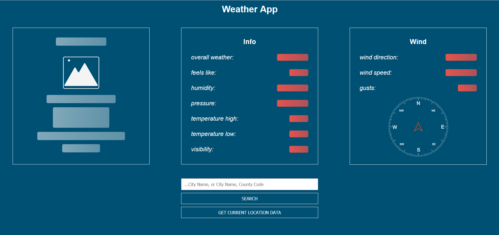
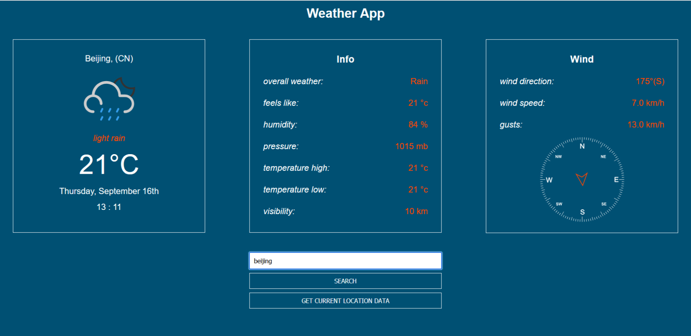

# Weather-app
 

 
 

 

# About
This project took me more time than expected. Main reason for that is the fact that I wasn't 
fully aware of all options and functionality I want to implement, so I made decisions along 
the way. Weather app is responsive, and works behind the scene with two third party API-s. 
First is <a href="https://rapidapi.com/Noggle/api/reverse-geocoding-and-geolocation-service/">Reverse Geocoding and Geolocation Service API</a>, and second is 
<a href="https://openweathermap.org/api">Open Weather Map API</a>.

On load event, app retrieves and stores browsers geolocation information(lat, lon) from Navigator.Geolocation Web API.
That data is used for reversed geocoding, if user choice is to see weather options for the location of his presence.
Other option is to search manually for desired city, or even add country code after city name, in order to avoid conflicting
results(for example, if you type 'Rome' meaning Italian capital, result will be some small U.S. town, so you would need to type
'Rome, it' for correct output)

# Tech
This Weather app was created in HTML, CSS and JavaScript. Icons are in SVG format and customized for this project, as well as the wind direction gadget.
Date string is gathered from Iternationalization (Intl) Web API. 
While loading data, app displays skeleton pulsing animation. 
Async tasks were handled with async/await syntax, if request lasts longer than 5 seconds, error will be rendered in the main box.

